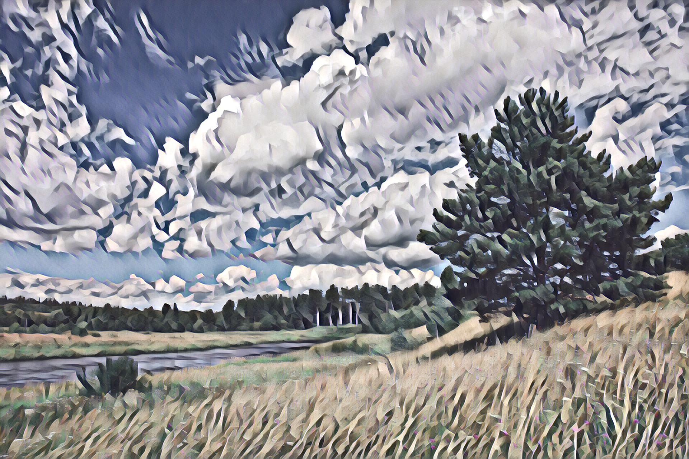
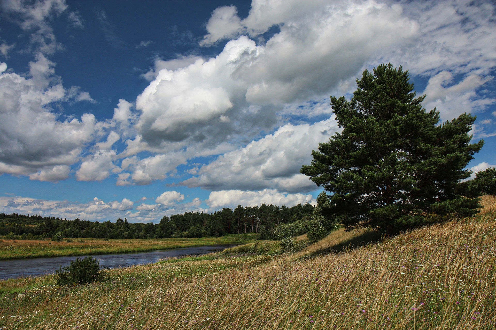

# Fast Style Transfer

Tensorflow 2.0 implementation of Fast Style Transfer which merges the style of one picture with the content of another.

Code based on [emla2805/fast-style-transfer](https://github.com/emla2805/fast-style-transfer)

The algorithm is based on [Perceptual Losses for Real-Time Style Transfer and Super-Resolution](https://arxiv.org/abs/1603.08155) 
with the addition of [Instance Normalization](https://arxiv.org/pdf/1607.08022.pdf).

<p align="center">
    
</p>

## Requirements

Python 3.7+ (in virtual environment or else), required dependencies:

```bash
pip install -r requirements.txt
```

## Usage

To style an image using a pre-trained model specify the input and output image paths and the log directory containing model checkpoints.

### Style image

```bash
python style.py \
    --image-path path/to/content/image.jpg \
    --log-dir log/dir/ \
    --output-path path/to/output/image.png
```
You can also add `--cpu` to prevent using GPU.

### Style all images in folder

```bash
python style_dir.py \
    --image-path path/to/content/ \
    --log-dir log/dir/ \
    --output-path path/to/output/
```

You can also add `--cpu` to prevent using GPU, `--png` to save into PNG and `--prefix` to add to each filename.

### Train model

```bash
python train.py \
    --log-dir log/dir/ \
    --style-image path/to/style/image.jpg \
    --test-image path/to/test/image.jpg
```

`--style-weight` and `--content-weight` allows to adjust balance between keeping style and content respectfully.  

`--epochs` setup number of passed on dataset.  

`--learning-rate` and `--batch-size` setup training parameters.  

`--image-size` is size to which dataset images resized and cropped.  

`--vgg19` command to use VGG19 network, which lead to styling similar to [lengstrom/fast-style-transfer](https://github.com/lengstrom/fast-style-transfer) but not 100%.  

1 epoch of training, which uses the COCO 2014 train dataset, takes about 40 minutes on GTX 1080 Ti.  

If you don't already have dataset in TensorFlow Datasets folder and format, then it will be downloaded (~38Gb) on first start and repacked (will require additional 38Gb+ on disk and few hours).

## Example models

<div align="center">
  		
</div>

<div align="center">
  
  
</div>

Training: 
udnie_479neg - style-weight 100, content-weight 10, epoch 1, batch 16, learning-rate 0.001, vgg19


## NaN explosion prevention

On default parameters image [COCO_train2014_000000105396.jpg](http://images.cocodataset.org/train2014/COCO_train2014_000000105396.jpg) cropped to white rectangle without any details which (by confusing content estimator?) with ~70% chances turns few weights of network to NaNs or with ~10% chances a lot of weights and so whole NN became unusable. To prevent this dataset shuffle turned off and specific step is blocked, but it is valid only for default batch-size = 16. Network with few NaNs seems to not work on CPU while could train and work on GPU.
